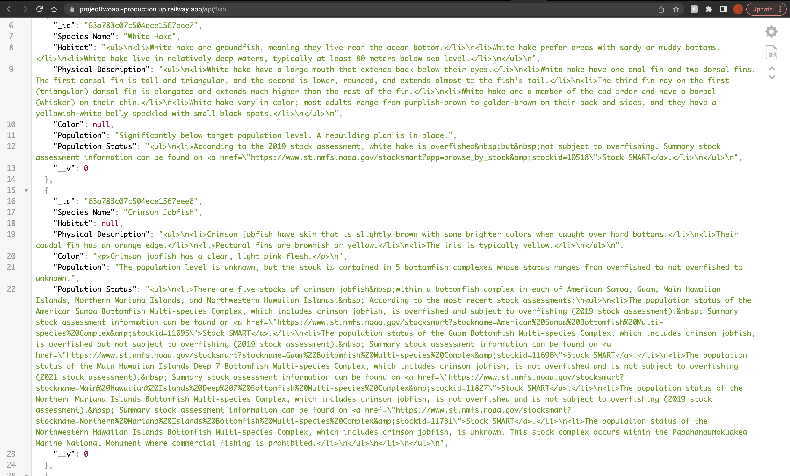
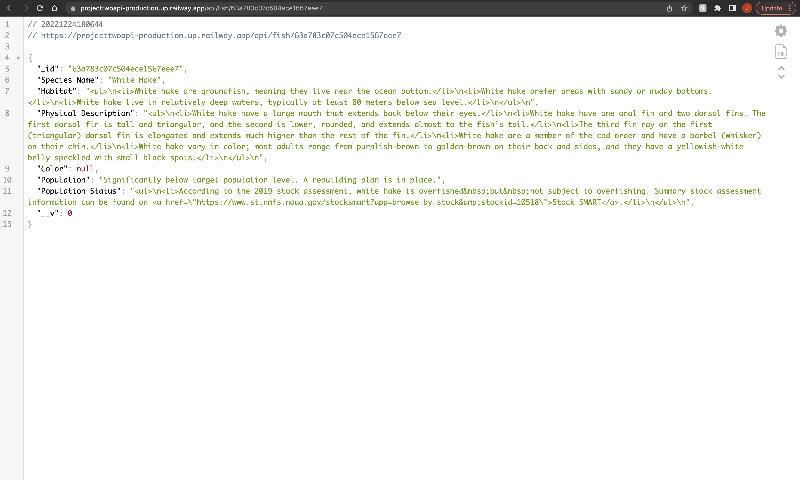

# Project Two: "Fish API"
---
### Description
---
This is an API or application programming interface developed as my second personal project while studying at General Assembly.

This is a *Fish API* which can be used in other projects that require information about a particular species of fish or to learn about some of the many creatures that live in the water.

### Features
---
- You are able to grab all fish at once by typing the project link and adding '/fish' to the end. This will retrieve the information on all 116 fish in the API ex: www.fishapilink.com/api/**fish** (*This is not an actualy link to the API*)
- If you would like to grab a specific species of fish you would simply take the id of the fish and add it to the end of the link like so:  www.fishapilink.com/api/fish/**63a783c07c504ece1567eee6** (*This is not an actual link to the API*)
### Future Features
---
- For the future I would like to add a Front End to this api, a friendlier user interface that includes a search bar to simplify finding specific information
- Switching from finding species by a long id to finding species by a number based on the position they are on the list. 
- Adding pictures for each individual species that pops up when that specific species is queried. 
- And finally an API key for security.
### Technologies Used
---
For this project I used the following:
- Javascript
- MongoDB
- Mongoose 
- Node.js
- Express.js
### Instructions/Getting Started 
---
Using the API is pretty simple and straight forward, as I mentioned above. To get the information on all the fish you would type this link:  https://projecttwoapi-production.up.railway.app/api/fish (*This* **IS** *the actual link to the API*) into your browser. From here you can look for the ID of a specific species you need and add it to the end of the link like so: https://projecttwoapi-production.up.railway.app/api/fish/63a783c07c504ece1567eeea (*Actual API link for "The American Lobster"*) you can reference this link and pull information as needed for your projects.
### Contribution Guidelines 
---
Should anyone want to take a look at the code for this API to identify bugs, make contributions, propose improvements, or just make comments. The link to the github main repository is: https://github.com/HowzayCalderon/projectTwoAPI